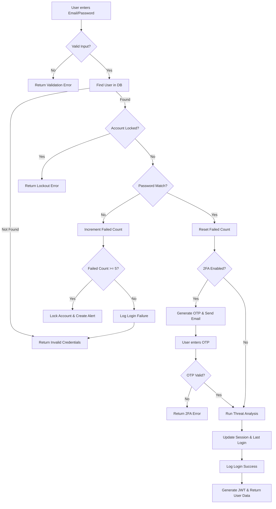
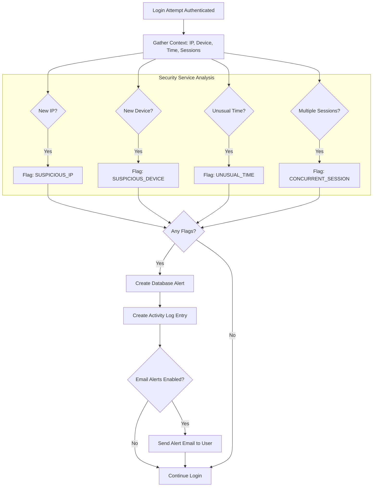
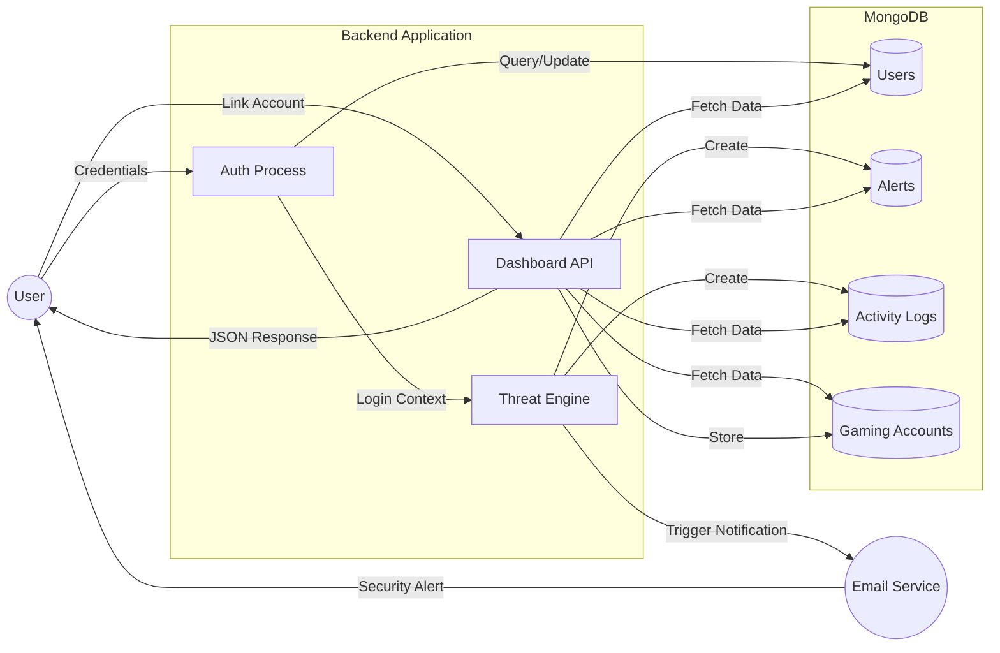
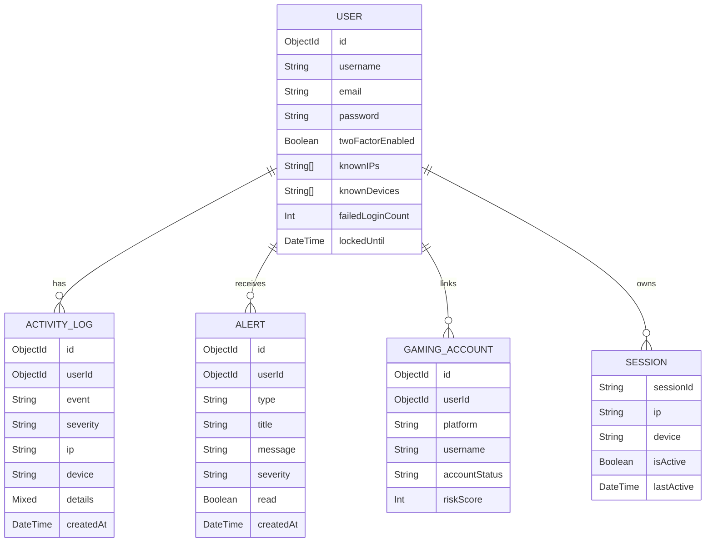

# GameGuard System Diagrams

You can copy the code blocks below into [Mermaid Live Editor](https://mermaid.live/) to generate downloadable PNG/SVG images.

## 1. Login Process Flowchart

## 2. Threat Detection Process Flowchart

## 3. Data Flow Diagram (DFD - Level 1)

## 4. Entity Relationship Diagram (ERD)

